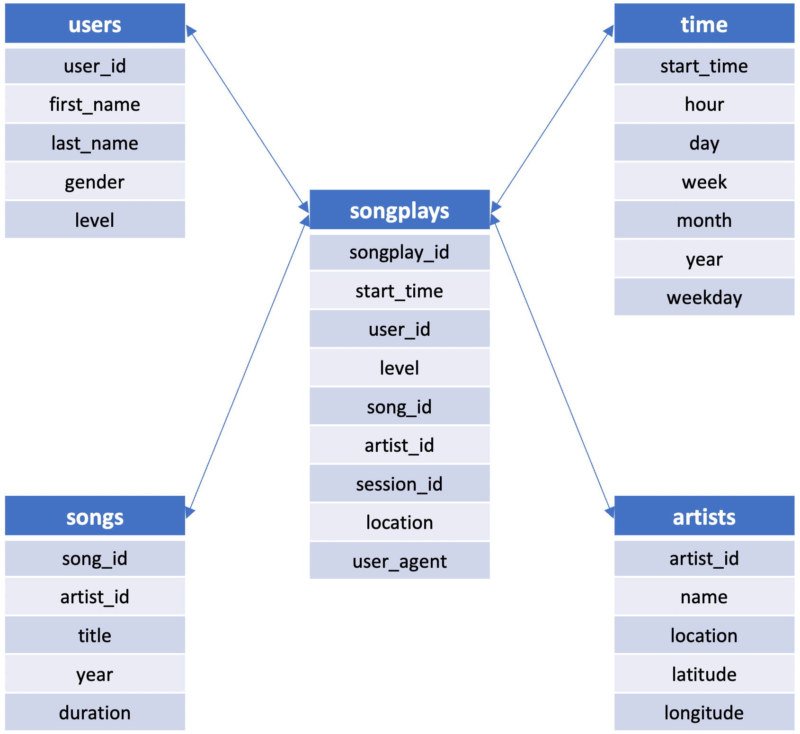

# Data Modeling with Postgres

## Project Intro

A startup called Sparkify wants to analyze the data they've been collecting on songs and user activity on their new music streaming app. The analytics team is particularly interested in understanding what songs users are listening to. Currently, they don't have an easy way to query their data, which resides in a directory of JSON logs on user activity on the app, as well as a directory with JSON metadata on the songs in their app.

They'd like a data engineer to create a Postgres database with tables designed to optimize queries on song play analysis, and bring you on the project. Your role is to create a database schema and ETL pipeline for this analysis. You'll be able to test your database and ETL pipeline by running queries given to you by the analytics team from Sparkify and compare your results with their expected results.

## Project Description

In this project, you'll apply what you've learned on data modeling with Postgres and build an ETL pipeline using Python. To complete the project, you will need to define fact and dimension tables for a star schema for a particular analytic focus, and write an ETL pipeline that transfers data from files in two local directories into these tables in Postgres using Python and SQL.

## Requirements

* PosgreSQL available on your machine - note the virtual environment through Udacity contained access to this
* Python 3; specific libraries: `pandas` and `psycopg2`, the latter is a driver used to connect PostgreSQL

## How to Run the Python Scripts

Through your terminal run these scripts in the following order:

1. ```python sql_queries.py```
2. ```python create_tables.py```
2. ```python etl.py```

## Database Schema

Data in the schema is grabbed from the JSON datasets available in the data folder. Here's a star schema with a central fact table (songplays) and 4 dimension tables:

<p align="center">
  
</p>

## JSON datasets in the data folder

### song_data

Contains data from the Million Song Dataset. Each file contains metadata about a song and its artist. Here's an example of a single song JSON file (TRABBJE12903CDB442.json):

```
{
    num_songs:1
    artist_id:"ARGCY1Y1187B9A4FA5"
    artist_latitude:36.16778
    artist_longitude:-86.77836
    artist_location:"Nashville, TN."
    artist_name:"Gloriana"
    song_id:"SOQOTLQ12AB01868D0"
    title:"Clementina Santafè"
    duration:153.33832
    year:0
}
```

### log_data

Log files are partitioned by year and month. This data contains information of songs played by users. 

## Python scripts and jupyter notebooks

## sql_queries.py

Python script defining all SQL DDL referenced in the scripts below.

## create_tables.py

Python script recreating the database and tables used to store data.

## etl.ipynb

Jupyter notebook used to explore the data and build/check ETL commands.

## etl.py

Python script for processing and inserting the log and song JSON files into the database.

## test.ipynb

Jupyter notebook that used to check that data was read in correctly.